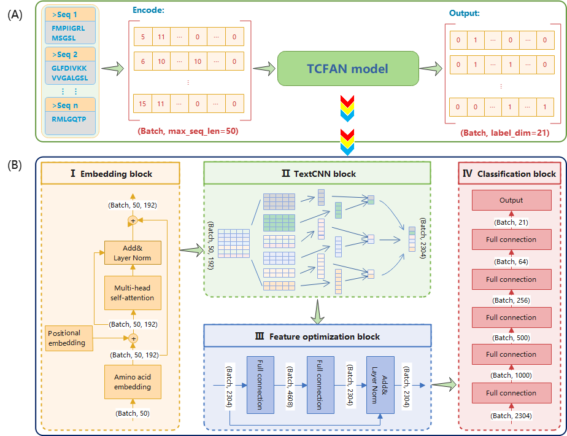
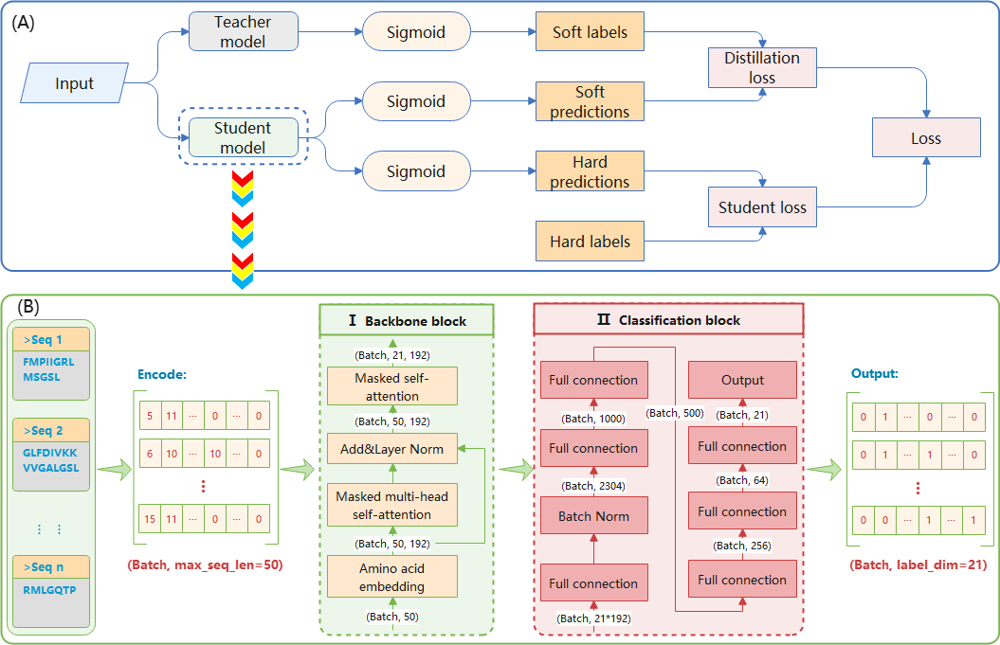

# TCFAN
Deep learning-based multi-functional therapeutic peptides prediction wih an imbalance-compensating weighted loss funcation


## Introduction
In this paper, we develop a novel deep neural network-based MLC model named TCFAN to predict MFPTs. This work has the following advantages over existing methods: 
(1) In the TCFAN model, semantic-based and position-based embedding combined with MHSA could capture more peptide sequence information, and TextCNN could extract the more effective information of peptide sequence. 
(2) To handle the imbalance dataset and improve the prediction performance, we designed a novel loss function for MLC based on FL and DL. The novel loss function dynamically assigns weights to labels by exploiting label correlations. 
(3) For the interpretability of the TCFAN model, we construct a student model and utilize knowledge distillation to improve the transparency of the TCFAN model, and visualize the key amino acids (AAs) in the peptide sequence that are important on MFTPs prediction.






## Related Files

#### TCFAN

| FILE NAME         | DESCRIPTION                                                                              |
|:------------------|:-----------------------------------------------------------------------------------------|
| main.py           | the main file of TCFAN predictor (include data reading, encoding, and data partitioning) |
| KD_main.py        | the main file of knowledge distillation                                                  |
| train.py          | train model                                                                              |
| model.py          | model construction                                                                       |
| util.py           | utils used to build models                                                               |
| evaluation.py     | evaluation metrics (for evaluating prediction results)                                   |
| plot-attention.py | evaluation metrics (for evaluating prediction results)                                   |
| dataset           | data                                                                                     |
| result            | Models and results preserved during training.                                            |
| Figs              | Saved figures                                                                            |


## Installation
- Requirement
  
  OS：
  
  - `Windows` ：Windows10 or later
  
  - `Linux`：Ubuntu 16.04 LTS or later
  
  Python：
  
  - `Python` >= 3.6
  
- Download `TCFAN`to your computer

  ```bash
  git clone https://github.com/xialab-ahu/TCFANFDL.git
  ```

- open the dir and install `requirement.txt` with `pip`

  ```
  cd TCFANFDL
  pip install -r requirement.txt
  ```


## Run TCFANFDL on a new test fasta file
```shell
python predictor.py --file test.fasta --out_path result
```

- `--file` : input the test file with fasta format

- `--out_path`: the output path of the predicted results


## Contact
Please feel free to contact us if you need any help.

